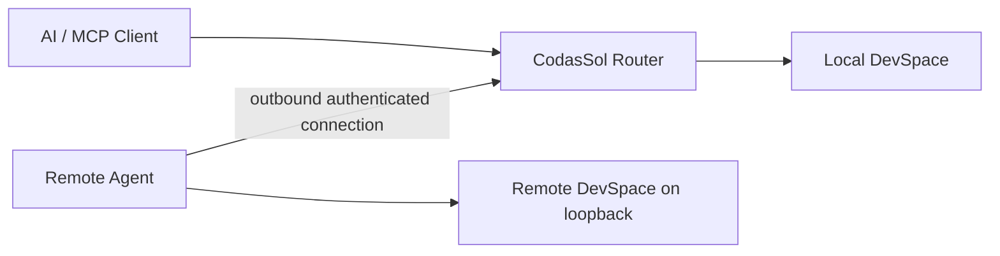

<div align="center">

# CodasSol Router

### **Stop switching machines. Start giving orders.**

**One AI entry point. Any workspace. Any machine.**

[](https://github.com/SeanWu089/CodasSol-Router/releases/latest)
[](https://nodejs.org/)
[](LICENSE)
[](https://modelcontextprotocol.io/)

**A thin, self-hosted routing layer that lets AI agents work across your computers without making you choose the machine every time.**

</div>

---

## What is CodasSol Router?

Your files do not live on one computer.

Your projects might be on a MacBook, a Windows desktop, a home server, a GPU box, or a machine you left at the office. Traditional remote access lets you *reach* those machines — but you still have to remember where the work lives, connect to the right host, and switch context yourself.

CodasSol Router makes the **physical machine a routing detail**.

It sits in front of [DevSpace](https://www.npmjs.com/package/@waishnav/devspace) and exposes one MCP-facing entry point:

```text
You / AI client
      |
      | one MCP endpoint
      v
CodasSol Router
      |
      | "Where does this workspace live?"
      |
      +----> Mac DevSpace ------> /Users/.../project
      |
      +----> Windows Agent -----> DevSpace -----> C:\Users\...\project
```

Open a Windows workspace from a conversation currently executing through a Mac Router, and CodasSol routes the call to Windows. After the workspace is opened, its `workspace_id` stays bound to that device, so later reads, edits, shell commands, and Git operations keep going back to the same machine automatically.

> **The AI should care about the workspace — not which box happens to hold it.**

---

## The fun version

Instead of:

```text
"Which computer has that file?"
-> remote desktop
-> switch machine
-> find project
-> reconnect tools
-> do the thing
```

you can aim for:

```text
"Move the SuYou shortcut on my Windows desktop to the Recycle Bin."
```

and the path becomes:

```text
AI client
   -> CodasSol Router on Mac
      -> C:\Users\...\Desktop resolves to Windows
         -> Windows Agent
            -> local DevSpace
               -> action happens on Windows
```

No separate Windows MCP endpoint needs to be exposed to the client, and the remote machine does not need an inbound public port.

---

## Why build this on DevSpace?

CodasSol does **not** try to replace DevSpace.

DevSpace is the execution backend: it owns local workspaces, filesystem operations, shell execution, coding-agent integrations, and local permission boundaries. CodasSol adds the missing **multi-device control plane** in front of it.

| Capability | DevSpace | CodasSol Router + DevSpace |
| --- | :---: | :---: |
| Local workspace / file / shell tools | ✅ | ✅ |
| Local allowed-root boundary | ✅ | ✅ |
| One MCP entry point | ✅ | ✅ |
| Multiple physical computers behind that entry point | — | **✅** |
| Device registry + online presence | — | **✅** |
| Windows/macOS-aware path routing | — | **✅** |
| `path -> device` selection | — | **✅** |
| Sticky `workspace_id -> device` binding | — | **✅** |
| Outbound-only remote Agent transport | — | **✅** |
| Fail closed on ambiguous/offline routes | — | **✅** |
| Per-device enrollment credentials | — | **✅** |
| Self-contained Windows Agent installer | — | **✅** |

> **DevSpace decides how work happens on a machine. CodasSol decides which machine should receive the work.**

---

## Routing model

CodasSol V1 uses a small set of deterministic rules.

### 1. Path chooses the device

Each device advertises explicit workspace roots.

```text
Mac
  /Users/you/...

Windows
  C:\Users\you
  D:\
```

An `open_workspace` call is matched with platform-aware path semantics. The most specific matching online device wins.

### 2. Workspace identity becomes device affinity

When DevSpace returns `workspace_id = ws_xxx`, CodasSol persists:

```text
ws_xxx -> device_id
```

Every later MCP call carrying that `workspace_id` returns to the same device.

### 3. Ambiguity fails closed

CodasSol does not silently guess when:

- multiple devices are equally valid;
- a bound device is offline;
- one MCP batch tries to cross devices;
- a workspace has no valid binding.

Wrong-machine execution is worse than an explicit routing error.

---

## Network model

Remote Agents connect **outbound** to the Router.



The remote computer does **not** need a public IP, inbound firewall rule, its own public MCP URL, or a second public tunnel just for CodasSol.

The Router creates a one-time enrollment boundary, then issues a separate long-lived token for that device. DevSpace OAuth stays local to each computer.

---

## Quick start

### Router machine

Requirements: Node.js 22+ and an initialized local DevSpace.

```bash
git clone https://github.com/SeanWu089/CodasSol-Router.git
cd CodasSol-Router

npm test
./scripts/mac/install-autostart.sh
```

Check the Router and get the pairing token:

```bash
curl http://127.0.0.1:17676/_codassol/health
npm run router:lan
npm run router:pairing-token --silent
```

### Windows Agent

Download the latest **`CodasSol-Windows-Agent-*.zip`** from **[GitHub Releases →](https://github.com/SeanWu089/CodasSol-Router/releases/latest)**.

Then:

1. Extract the ZIP.
2. Double-click `INSTALL.cmd`.
3. Choose the workspace-access policy.
4. Enter the Router URL.
5. Paste the one-time pairing token.

The installer carries its own Node.js 22 x64 runtime, installs DevSpace privately under `%LOCALAPPDATA%\CodasSol\Agent`, and creates current-user autostart tasks.

Recommended Windows access policy:

```text
C:\Users\<you>
+ all fixed non-system drives
```

It intentionally does **not** expose the whole `C:\` system drive by default.

Verify from the Router:

```bash
npm run router:agents --silent
```

Full Windows details: [`docs/windows-setup.md`](docs/windows-setup.md)

---

## Security by default

- **Loopback-first Router** — default listener is `127.0.0.1`.
- **Outbound remote Agents** — remote machines initiate the connection.
- **One-time pairing token** — used only to enroll a device.
- **Different per-device token** — enrollment credentials are not reused as runtime credentials.
- **Local DevSpace OAuth** — DevSpace owner/access/refresh tokens stay on their own machine.
- **Explicit allowed roots** — Windows DevSpace roots and advertised Router roots are synchronized.
- **No whole-system-drive default** — the recommended Windows policy avoids exposing `C:\`.
- **Fail-closed routing** — ambiguity or offline state produces an error instead of a guess.
- **Private state stays outside Git** — tokens, device records, bindings, and local paths remain private.
- **Public release bundles contain no build-machine LAN address by default** as of `v0.1.2`.

Read [`SECURITY.md`](SECURITY.md) before exposing a Router beyond a trusted network.

---

## What CodasSol is — and is not

**Not another remote desktop.** Remote desktop streams a screen and input. CodasSol routes structured agent/tool operations to the correct execution environment.

**Not a VPN replacement.** VPNs solve private network reachability. CodasSol solves agent action routing and workspace affinity. They can complement each other.

**Not an AI model.** CodasSol does no inference. Bring the AI client/model you want; DevSpace remains the execution layer.

**Not a hosted service.** The public repository is the framework. Device identities, credentials, paths, and bindings belong to your private deployment.

---

## Why the routing abstraction matters

There are already strong projects for multi-device agent execution, remote desktops, gateways, and self-hosted workers.

CodasSol deliberately explores a smaller abstraction:

```text
workspace identity
       |
       v
physical-machine affinity
```

The user or model should not need to call `remote_exec(agent_id="windows-pc", ...)` for every operation. Once a workspace is resolved, normal DevSpace tools keep their normal shape. The Router carries the machine affinity.

That makes CodasSol closer to a **transparent workspace router** than a remote-control dashboard.

---

## Releases

### `v0.1.2` — current

Public bundle privacy hotfix. Public Windows artifacts no longer embed the build machine's LAN Router address.

### `v0.1.1`

Fixed the first real multi-device integration issue: DevSpace `allowedRoots` and Agent-advertised roots could disagree on an existing Windows installation. The installer now synchronizes both and offers an explicit access policy.

### `v0.1.0` — historical / superseded

First self-contained Windows Agent bundle. Kept as a prerelease so the development history remains inspectable.

See **[all Releases](https://github.com/SeanWu089/CodasSol-Router/releases)**.

---

## Where this can go

The next useful layers are not “more AI.” They are **better control over a personal compute fabric**:

- per-action approvals and capability policies;
- audit logs and device activity history;
- device aliases, tags, groups, and capability-aware routing;
- signed Agent updates and protocol compatibility checks;
- Linux packaging and service installers;
- GUI/browser/computer-use capabilities behind explicit permissions;
- mobile-first command and approval surfaces;
- secure Internet reachability without directly exposing the Router;
- task hand-off between machines;
- wake/sleep awareness and Wake-on-LAN;
- routing by hardware capability (`gpu`, `cuda`, `macos`, `office-pc`) in addition to path;
- consumer workflows such as “send me that file,” “start this download,” or “run this task at home.”

> **What if all of your computers behaved like one addressable pool of capabilities?**

---

## Development

```bash
npm test
```

Current V1 tests cover Agent enrollment/heartbeat/job transport, local DevSpace OAuth, Windows path semantics, most-specific-root selection, ambiguity/offline fail-closed behavior, sticky workspace bindings, cross-device batch rejection, Router proxying, and health checks.

---

## Public framework vs. private deployment

Never commit or publish real device credentials, pairing secrets, local path inventories, workspace bindings, tunnel credentials, API keys, or certificates/private keys.

Local Router state belongs under `~/.codassol/`. Windows Agent state belongs under `%USERPROFILE%\.codassol\`.

---

## License

MIT.

<div align="center">

### **Stop switching machines. Start giving orders.**

</div>
